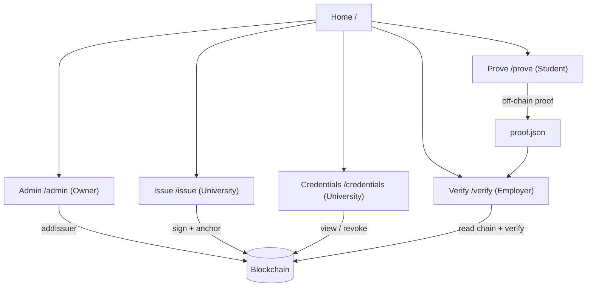
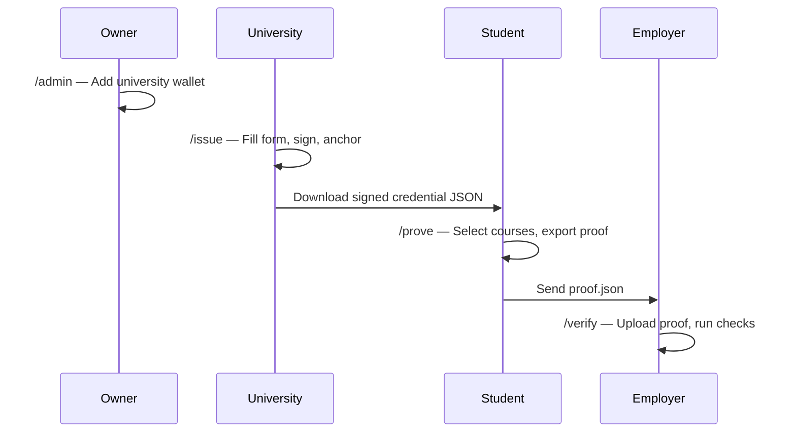
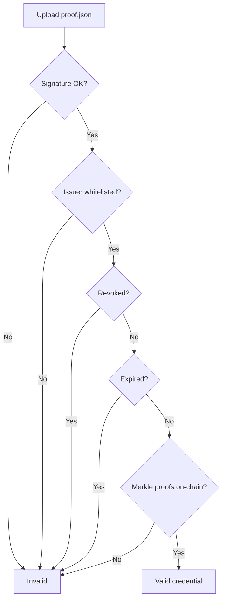

# CredChain Frontend

React web application for the full credential lifecycle: **Owner → University → Student → Employer**.

This is the **recommended interface for demos and presentations**. No terminal required after setup.

See also: [Project overview](../README.md) · [Scripts / CLI](../scripts/README.md)

---

## Table of contents

1. [Setup](#1-setup)
2. [MetaMask configuration](#2-metamask-configuration)
3. [Application map](#3-application-map)
4. [Demo walkthrough](#4-demo-walkthrough)
5. [Admin (Owner)](#5-admin-owner)
6. [Issue (University)](#6-issue-university)
7. [Credentials (University)](#7-credentials-university)
8. [Prove (Student)](#8-prove-student)
9. [Verify (Employer)](#9-verify-employer)
10. [Environment variables](#10-environment-variables)
11. [Troubleshooting](#11-troubleshooting)

---

## 1. Setup

### Prerequisites

- Node.js 18+
- MetaMask browser extension
- Sepolia ETH on two wallets: **owner** (deployer) and **university** (issuer)

### Install and run

```bash
# From repo root
npm install

# Deploy contracts once (if not done yet)
# Set contracts/.env: PRIVATE_KEY, SEPOLIA_RPC_URL
npm run deploy:sepolia

# Configure frontend
cp frontend/.env.example frontend/.env
```

Edit `frontend/.env`:

```env
VITE_NETWORK=sepolia
VITE_REGISTRY_ADDRESS=0x...   # from deploy output
VITE_VERIFIER_ADDRESS=0x...   # from deploy output
```

```bash
npm run frontend
```

Open **http://localhost:5173**

> Restart the dev server after any `.env` change.

---

## 2. MetaMask configuration

### Sepolia (default)

1. MetaMask → **Networks** → enable **Sepolia test network**
2. Import or select:
   - **Owner wallet** — same private key as `PRIVATE_KEY` in `contracts/.env`
   - **University wallet** — a separate account you will register as issuer

### Localhost (optional)

| Field | Value |
|-------|-------|
| Network name | Localhost |
| RPC URL | `http://127.0.0.1:8545` |
| Chain ID | `31337` |
| Currency | ETH |

Set `VITE_NETWORK=localhost` in `frontend/.env` and run `npm run node` + `npm run deploy`.

---

## 3. Application map



| Page | Route | Wallet required? | Role |
|------|-------|------------------|------|
| Home | `/` | No | Overview |
| Admin | `/admin` | Yes — **owner** | Register universities |
| Issue | `/issue` | Yes — **university** | Create credential |
| Credentials | `/credentials` | Yes — **university** | List / revoke |
| Prove | `/prove` | No | Selective disclosure |
| Verify | `/verify` | No | Validate proof |

### Navigation bar (illustration)

```
┌─────────────────────────────────────────────────────────────────────────────┐
│ [CredChain]  Issue  Credentials  Prove  Verify  Admin     ⬡ 0x5FcA… Sepolia │
│              Univ   Univ         Student Employer Owner                      │
└─────────────────────────────────────────────────────────────────────────────┘
```

---

## 4. Demo walkthrough

Complete flow in order:



| Step | Who | Page | Output |
|------|-----|------|--------|
| 0 | Owner | `/admin` | University registered on-chain |
| 1 | University | `/issue` | `STU001_signed.json` |
| 2 | Student | `/prove` | `proof_<hash>.json` |
| 3 | Employer | `/verify` | Pass / fail report |

---

## 5. Admin (Owner)

**Purpose:** Register which wallet addresses may issue credentials.

### UI layout

```
┌─ Deployment ─────────────────────────────────────────────────┐
│ Network: Sepolia    Registry: 0x8941…    Owner: 0x5FcA…      │
│ ✓ CONTRACT OWNER CONNECTED                                   │
└──────────────────────────────────────────────────────────────┘

┌─ Registered Universities (0) ──────────────────── [↺ Refresh]┐
│ No universities yet — paste a wallet address below.          │
│                                                              │
│ [ 0x70997970C51812dc3A010C7d01b50e0d17dc79C8            ]   │
│                                    [ + Add University ]      │
└──────────────────────────────────────────────────────────────┘
```

### Steps

1. Connect MetaMask with the **deployer / owner** wallet
2. Confirm badge: **✓ Contract owner connected**
3. Paste the **university** wallet address (not the owner address)
4. Click **+ Add University**
5. Confirm transaction in MetaMask
6. University appears in the list

> The list is stored in this browser after adding. Use the same browser for demo, or set `VITE_KNOWN_ISSUERS` in `.env`.

---

## 6. Issue (University)

**Purpose:** Build, sign, and anchor a student credential.

### UI layout

```
┌─ Issue Credential ───────────────────────────────────────────┐
│ ✓ Registered issuer                                          │
│                                                              │
│ Student Name    [ Nguyen Van A        ]                      │
│ Student ID      [ STU001              ]                      │
│ University      [ HUST                ]                      │
│ Graduation Date [ 2025-06-01          ]                      │
│                                                              │
│ Courses:                                                     │
│   [ Blockchain Fundamentals ] [ A+ ]  [×]                    │
│   [ Web Development         ] [ A  ]  [×]                    │
│   [ + Add course ]                                           │
│                                                              │
│              [ Issue Credential ]                            │
└──────────────────────────────────────────────────────────────┘
```

### Steps

1. Switch MetaMask to the **university** wallet (registered in Admin)
2. Open **/issue**
3. Wait for **✓ Registered issuer**
4. Fill student details and courses
5. Click **Issue Credential**
6. MetaMask prompts:
   - **Sign message** (EIP-191 over credential hash)
   - **Confirm transaction** (`registry.anchor`)
7. Download **`{studentId}_signed.json`** — give this file to the student

---

## 7. Credentials (University)

**Purpose:** View credentials anchored by your wallet and revoke if needed.

### UI layout

```
┌─ My Anchored Credentials ──────────────────────── [↺ Refresh]┐
│ Lookup by hash: [ 0xabc…                          ] [Search] │
│                                                              │
│ ┌──────────────────────────────────────────────────────────┐ │
│ │ STU001  credentialHash: 0x1a2b…   [ Revoke ]           │ │
│ └──────────────────────────────────────────────────────────┘ │
└──────────────────────────────────────────────────────────────┘
```

Connect the **university** wallet. Only credentials issued by that address are listed.

---

## 8. Prove (Student)

**Purpose:** Select which courses to reveal; generate a Merkle proof file.

**No wallet required.**

### UI layout

```
┌─ Prove Credential ───────────────────────────────────────────┐
│ [ Upload signed credential JSON ]                            │
│                                                              │
│ Select courses to disclose:                                  │
│   ☑ Blockchain Fundamentals  (A+)                            │
│   ☑ Web Development          (A)                             │
│   ☐ Database Systems         (B+)   ← hidden from employer   │
│                                                              │
│              [ Generate Proof ]                              │
│              [ ↓ Download proof.json ]                       │
└──────────────────────────────────────────────────────────────┘
```

### Steps

1. Open **/prove**
2. Upload the signed credential from Issue step
3. Check only the courses to share
4. **Generate Proof** → **Download** `proof_<hash>.json`
5. Send proof file to employer (email, USB, etc.)

---

## 9. Verify (Employer)

**Purpose:** Validate signature, issuer status, revocation, expiry, and Merkle proofs.

**No wallet required** (reads Sepolia via public RPC).

### UI layout

```
┌─ Verify Credential ──────────────────────────────────────────┐
│ [ Upload proof.json ]                                        │
│                                                              │
│              [ Run Verification ]                            │
│                                                              │
│ ┌─ Results ────────────────────────────────────────────────┐ │
│ │ ✓ Signature valid                                        │ │
│ │ ✓ Issuer authorized                                      │ │
│ │ ✓ Not revoked                                            │ │
│ │ ✓ Not expired                                            │ │
│ │ ✓ Merkle proofs valid (2 courses)                        │ │
│ │                                                          │ │
│ │ Disclosed: Blockchain Fundamentals A+, Web Development A │ │
│ └──────────────────────────────────────────────────────────┘ │
└──────────────────────────────────────────────────────────────┘
```

### Verification pipeline



---

## 10. Environment variables

| Variable | Required | Description |
|----------|----------|-------------|
| `VITE_NETWORK` | Yes | `sepolia` or `localhost` |
| `VITE_REGISTRY_ADDRESS` | Yes | `CredentialRegistry` address |
| `VITE_VERIFIER_ADDRESS` | Yes | `MerkleVerifier` address |
| `VITE_SEPOLIA_RPC_URL` | No | Custom RPC (default: publicnode) |
| `VITE_REGISTRY_DEPLOY_BLOCK` | No | Optional — load old issuer list from events |
| `VITE_KNOWN_ISSUERS` | No | Comma-separated issuer addresses |

---

## 11. Troubleshooting

| Problem | Solution |
|---------|----------|
| Add University does nothing | Paste full `0x…` address first; confirm MetaMask popup |
| Not contract owner | Use deployer wallet (`PRIVATE_KEY` from `contracts/.env`) |
| Issuer not registered | Owner must add university on `/admin` first |
| Wrong network | Switch MetaMask to Sepolia; use button on Admin page |
| Issue page: not registered issuer | Connect university wallet, not owner |
| Verify fails: not anchored | Re-issue credential; check `VITE_REGISTRY_ADDRESS` matches deploy |
| `.env` changes ignored | Restart `npm run frontend` |
| RPC / log errors on Admin | Optional: set `VITE_SEPOLIA_RPC_URL` to Alchemy/Infura |

---

## Architecture (frontend)

```
IssuePage     → shared/logic + shared/merkle + lib/credential.ts + useAnchor
ProvePage     → shared/merkle (rebuild tree, generate proof)
VerifyPage    → lib/credential.ts + publicClient.readContract
AdminPage     → walletClient.writeContract (addIssuer / removeIssuer)
CredentialsPage → registryEvents (anchored credentials by issuer)
```

Shared crypto ensures the browser produces **identical hashes and proofs** as the CLI scripts.

---

