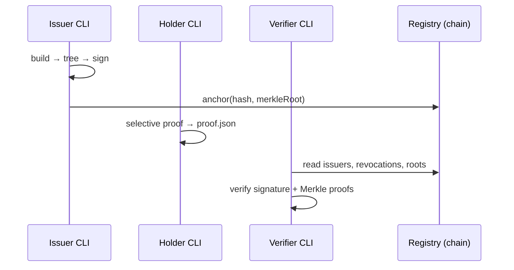

# CredChain — Scripts & CLI

Command-line tools for the same credential pipeline as the web UI. Use these for **automation**, **debugging**, **CI**, or when you prefer a terminal workflow.

> **For live demos and presentations, use the [Frontend](../frontend/README.md) instead.**  
> You do **not** need to run CLI scripts if the UI flow already works.

---

## Frontend vs scripts — when to use which?

| Scenario | Use |
|----------|-----|
| Demo, capstone presentation, non-technical audience | **Frontend** |
| Quick manual test of issue → prove → verify | **Frontend** |
| Automated regression / CI pipeline | **Scripts** (`npm run test:e2e`) |
| Debugging crypto or Merkle proofs step-by-step | **Scripts** |
| Batch issuing credentials from JSON files | **Scripts** |
| Headless server without browser / MetaMask | **Scripts** |
| One-time contract deploy | **Scripts** (`npm run deploy:sepolia` from root) |

Both paths call the same logic in `@credchain/shared/logic` and `@credchain/shared/merkle`.

```mermaid
flowchart TB
  subgraph UI["Frontend (browser)"]
    I1[IssuePage]
    P1[ProvePage]
    V1[VerifyPage]
  end
  subgraph CLI["Scripts (terminal)"]
    I2[issuer/*]
    P2[holder/*]
    V2[verifier/*]
  end
  S["@credchain/shared"]
  I1 --> S
  P1 --> S
  V1 --> S
  I2 --> S
  P2 --> S
  V2 --> S
  S --> C[(CredentialRegistry + MerkleVerifier)]
```



---

## Prerequisites

```bash
# From repo root
npm install
```

### Environment

```bash
cp scripts/.env.example scripts/.env
```

| Variable | Purpose |
|----------|---------|
| `UNIVERSITY_PRIVATE_KEY` | Wallet that signs and anchors credentials (CLI only) |
| `REGISTRY_ADDRESS` | Deployed `CredentialRegistry` |
| `VERIFIER_ADDRESS` | Deployed `MerkleVerifier` |
| `RPC_URL` | Sepolia or `http://127.0.0.1:8545` |
| `NETWORK` | `sepolia` or `localhost` |

Deploy keys live in **`contracts/.env`** (`PRIVATE_KEY`) — not in `scripts/.env`.

### Local chain (optional)

```bash
# Terminal 1
npm run node

# Terminal 2
npm run deploy
```

Register an issuer (owner wallet) via the [Admin page](../frontend/README.md#5-admin-owner) or Hardhat console.

---

## Pipeline overview

```
Issuer (scripts/issuer/)     Holder (scripts/holder/)     Verifier (scripts/verifier/)
────────────────────────     ────────────────────────     ───────────────────────────
buildCredential.ts           buildMerkleTree.ts           verifyCredential.ts
signCredential.ts            generateProof.ts
anchorCredential.ts          exportProof.ts
```



---

## Step-by-step CLI flow

All commands run from **`scripts/`**:

```bash
cd scripts
mkdir -p ../data/issued ../data/proofs
```

### 1. Build credential bundle

```bash
npm run issuer:build -- ../data/sample-student-input.json ../data/issued/STU001.json
```

### 2. Add salts + Merkle root

```bash
npm run holder:tree -- ../data/issued/STU001.json
```

### 3. Sign with university key

```bash
npm run issuer:sign -- ../data/issued/STU001.json
```

Requires `UNIVERSITY_PRIVATE_KEY` in `scripts/.env`. The wallet must be registered as an issuer on-chain.

### 4. Anchor on-chain

```bash
npm run issuer:anchor -- ../data/issued/STU001.json
```

### 5. Export selective proof (student)

Preview (stdout):

```bash
npm run holder:proof -- ../data/issued/STU001.json "Web Development" "Blockchain"
```

Export file:

```bash
npm run holder:export -- ../data/issued/STU001.json "Web Development,Blockchain" ../data/proofs/STU001_proof.json
```

### 6. Verify (employer)

```bash
npm run verify -- ../data/proofs/STU001_proof.json
```

Exit code `0` = valid, `1` = failed (JSON details printed).

---

## npm scripts reference

| Script | File | Description |
|--------|------|-------------|
| `issuer:build` | `issuer/buildCredential.ts` | Build `CredentialBundle` from input JSON |
| `issuer:sign` | `issuer/signCredential.ts` | EIP-191 sign `credentialHash` |
| `issuer:anchor` | `issuer/anchorCredential.ts` | `registry.anchor()` on-chain |
| `holder:tree` | `holder/buildMerkleTree.ts` | Random salts + Merkle root |
| `holder:proof` | `holder/generateProof.ts` | Preview disclosed courses (stdout) |
| `holder:export` | `holder/exportProof.ts` | Write `proof.json` |
| `verify` | `verifier/verifyCredential.ts` | Full 6-step verification |
| `test:e2e` | `tests/integration/e2e.test.ts` | Automated end-to-end test |

From repo root: `npm run test:e2e`

---

## Deploy

Deploy is run from the **root**, not from `scripts/`:

```bash
# Sepolia — set contracts/.env (PRIVATE_KEY, SEPOLIA_RPC_URL)
npm run deploy:sepolia

# Local Hardhat node
npm run node          # terminal 1
npm run deploy        # terminal 2
```

Copy printed addresses into `frontend/.env` and `scripts/.env`.

---

## Do I need to test scripts?

| Goal | Required? |
|------|-----------|
| Frontend demo works | **No** — scripts are optional |
| Prove CLI matches UI before submission | Run once: `npm run test:e2e` |
| CI / grading automation | **Yes** — run `test:e2e` + `test:contracts` |

Recommended before final submission:

```bash
npm run test:contracts
npm run test:e2e        # needs local node + deploy, or configured Sepolia .env
```

---

## Verification steps (CLI)

`verifyCredential.ts` runs six checks:

| # | Check | Where |
|---|--------|--------|
| 1 | ECDSA signature | Off-chain |
| 2 | Issuer whitelisted | `registry.issuers()` |
| 3 | Not revoked | `registry.revocations()` |
| 4 | Not expired | Off-chain timestamp |
| 5 | Merkle proofs | `MerkleVerifier.verify()` + anchored root |
| 6 | Aggregated result | JSON output |

---

## Troubleshooting

| Error | Fix |
|-------|-----|
| `UNIVERSITY_PRIVATE_KEY is not set` | Copy `scripts/.env.example` → `scripts/.env` |
| `not a registered issuer` | Owner adds wallet via `/admin` or `addIssuer()` |
| `merkleRoot is required` | Run `holder:tree` before sign/anchor |
| `Credential is not anchored` | Run `issuer:anchor` |
| Connection refused | Start Hardhat node or fix `RPC_URL` |
| Deploy account wrong | Use `PRIVATE_KEY` in **`contracts/.env`**, not `scripts/.env` |

---

## Further reading

- **[INSTRUCTIONS.md](./INSTRUCTIONS.md)** — Extended reference (schemas, library imports, Merkle leaf design)
- **[Frontend README](../frontend/README.md)** — UI demo walkthrough
